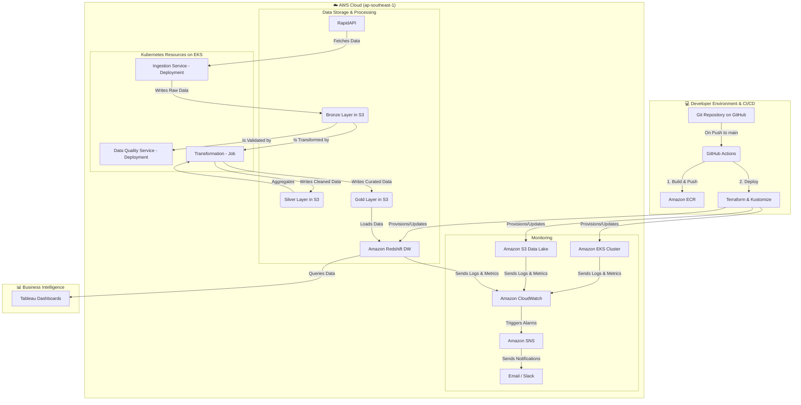

# Champions League Data Engineering Platform

A production-grade, cloud-native data engineering platform for Champions League analytics using AWS EKS, Kubernetes, Airflow (MWAA), Kustomize, and Terraform.

This project implements a complete, end-to-end data pipeline, from raw data ingestion to interactive visualization, showcasing modern data engineering principles and tooling.

## ✨ Key Features

- **Cloud-Native Infrastructure**: All components are containerized and orchestrated on AWS EKS using Kubernetes.
- **Infrastructure as Code (IaC)**: The entire AWS infrastructure is managed declaratively using Terraform.
- **Automated CI/CD**: GitHub Actions automates building, scanning, and deploying services to EKS.
- **Workflow Orchestration**: Complex data dependencies and schedules are managed by Apache Airflow (MWAA).
- **Data Quality Assurance**: Data integrity is enforced at every stage with Great Expectations.
- **Scalable Data Processing**: ETL jobs leverage PySpark for efficient, large-scale transformations.

## 🏗️ Architecture Diagram

### System Architecture Overview



### Data Flow

1. **Data Ingestion**: RAPID API → EKS Ingestion Service → S3 Bronze
2. **Data Quality**: S3 Bronze → EKS Quality Service → Validation Reports  
3. **Data Transformation**: S3 Bronze → EKS Spark Jobs → S3 Silver → S3 Gold
4. **Data Export**: S3 Gold → EKS Export Service → CSV/Excel/Tableau
5. **Data Warehouse**: S3 Gold → Redshift → Tableau Dashboards
6. **Orchestration**: Airflow DAG → Kubernetes Pod Operators → Services
7. **Monitoring**: CloudWatch → Metrics/Logs → Alarms → SNS → Notifications

### Architecture Features

- **Cloud-Native**: Full AWS EKS deployment with Kubernetes-native patterns
- **Scalable**: Auto-scaling based on demand and resource utilization
- **Fault-Tolerant**: Health checks, retries, and circuit breakers
- **Secure**: IAM roles, VPC, encryption at rest and in transit
- **Observable**: Comprehensive monitoring, logging, and alerting
- **Automated**: CI/CD pipeline with infrastructure as code
- **Cost-Optimized**: Spot instances, auto-scaling, and resource limits

## 🔧 Technology Stack

| Category | Technologies Used |
|----------|-------------------|
| **Cloud & Infrastructure** | AWS, EKS, EC2, S3, Redshift, Terraform, Kubernetes, Kustomize |
| **Data Processing** | PySpark, Pandas, Great Expectations |
| **Orchestration** | Apache Airflow (MWAA), Kubernetes Operators |
| **Services & APIs** | Flask, Python, Docker |
| **CI/CD & Monitoring** | GitHub Actions, Trivy, AWS CloudWatch |
| **Visualization** | Tableau |

## ☁️ AWS EKS Deployment

Follow these steps to deploy the platform to a production environment on AWS.

### 1. Configure Environment

Copy `.env.example` to `.env` and provide your credentials.

```bash
# RapidAPI Credentials
RAPIDAPI_KEY=your_rapidapi_key_here

# AWS Account ID
AWS_ACCOUNT_ID=123456789012
```

### 2. Deploy AWS Infrastructure

Use Terraform to provision all the necessary cloud resources, including the EKS cluster, S3 bucket, and MWAA environment.

```bash
cd terraform
terraform init
terraform apply
```

### 3. Configure IAM Roles for Service Accounts (IRSA)

This is a critical step to grant your pods AWS permissions.

1. Follow the [AWS documentation](https://docs.aws.amazon.com/eks/latest/userguide/enable-iam-roles-for-service-accounts.html) to create an IAM OIDC Provider for your new EKS cluster.

2. Create an IAM Role with trust policies for your ServiceAccounts (`data-ingestion-sa`, `data-quality-sa`).

3. Attach the required IAM policies (e.g., S3 access) to this role.

4. Annotate your Kubernetes ServiceAccounts to use this IAM Role ARN:

```bash
kubectl annotate serviceaccount data-ingestion-sa \
  -n champions-league \
  eks.amazonaws.com/role-arn=arn:aws:iam::YOUR_AWS_ACCOUNT_ID:role/Your-App-Role
```

### 4. Deploy to EKS

The GitHub Actions workflow will handle this automatically on every push to main. To do it manually, use Kustomize:

```bash
# Update your kubeconfig to point to the new EKS cluster
aws eks update-kubeconfig --name champions-league-cluster --region ap-southeast-1

# Apply all manifests using the production overlay
kubectl apply -k kubernetes/overlays/production
```

## 📂 Project Structure

| Path | Description |
|------|-------------|
| `airflow_dags/` | Contains all Apache Airflow DAGs for orchestrating the pipeline. |
| `data_quality/` | Great Expectations configurations, including expectation suites and checkpoints. |
| `docker/` | Dockerfiles for building the various microservices. |
| `kubernetes/` | All Kubernetes manifests, organized into base and overlays for Kustomize. |
| `src/` | Python source code for the microservices (ingestion, quality, etc.). |
| `terraform/` | Terraform scripts for provisioning the entire AWS infrastructure. |
| `visualizations/` | Tableau workbook files (.twb) for the final dashboards. |

## 🌐 API Endpoints Used

The platform ingests data from the UEFA Champions League API on RapidAPI:

- `/standingsv2` - Competition standings
- `/team/info` - Team information
- `/team/performance` - Team performance metrics
- `/team/results` - Match results
- ... and more.

## 🤝 Contributing

Pull requests are welcome! For major changes, please open an issue first to discuss what you would like to change. Please make sure to update tests as appropriate.

## 📄 License

This project is licensed under the MIT License. See the [LICENSE](LICENSE) file for details.